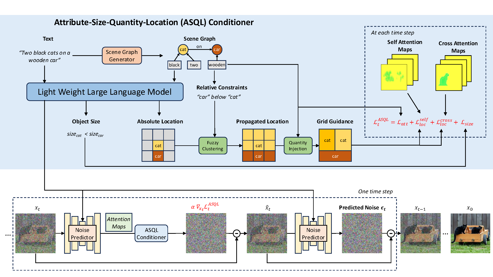

# All-in-One Conditioning for Text-to-Image Synthesis

Accurate interpretation and visual representation of complex prompts involving multiple objects, attributes, and spatial relationships is a critical challenge in text-to-image synthesis. Despite recent advancements in generating photorealistic outputs, current models often struggle with maintaining semantic fidelity and structural coherence when processing intricate textual inputs. We propose a novel approach that grounds text-to-image synthesis within the framework of scene graph structures, aiming to enhance the compositional abilities of existing models. Even though, prior approaches have attempted to address this by using pre-defined layout maps derived from prompts, such rigid constraints often limit compositional flexibility and diversity. In contrast, we introduce a zero-shot, scene graph-based conditioning mechanism that generates soft visual guidance during inference. At the core of our method is the Attribute-Size-Quantity-Location (ASQL) Conditioner, which produces visual conditions via a lightweight language model and guides diffusion-based generation through inference-time optimization. This enables the model to maintain text-image alignment while supporting lightweight, coherent, and diverse image synthesis.

  

## Installation

## Usage

## Citation
